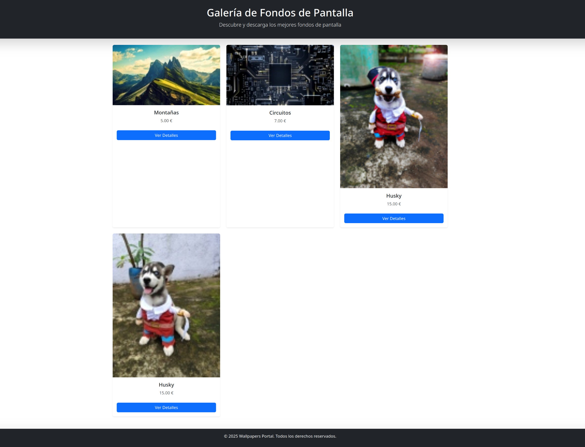
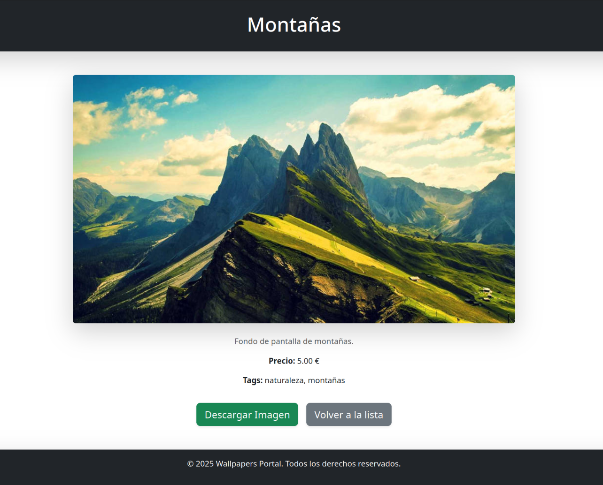
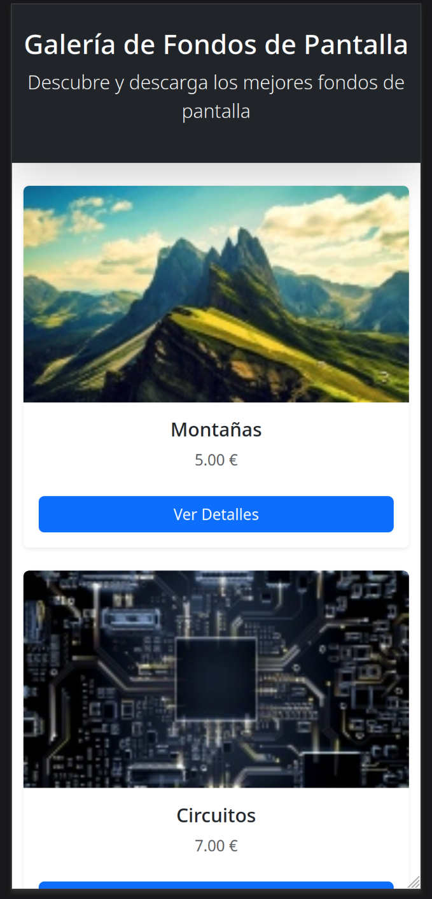
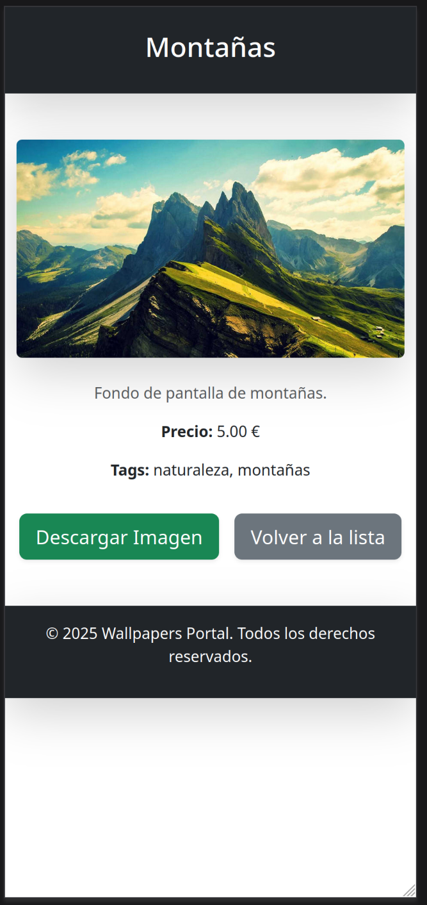

# cronos-portal-wallpaper-test1

# Mini Portal de Fondos de Pantalla

Este es un proyecto de Django que permite a los usuarios explorar y descargar fondos de pantalla. El proyecto incluye una interfaz web responsiva y fácil de usar, diseñada con Bootstrap para garantizar una experiencia de usuario atractiva y accesible en dispositivos móviles y de escritorio.


## Fundamento de Diseño

El diseño del portal se basa en los siguientes principios:

1. **Interfaz Limpia y Minimalista**: Se ha optado por un diseño simple que permite a los usuarios navegar fácilmente por la galería de fondos de pantalla sin distracciones innecesarias.

2. **Responsividad**: Utilizando Bootstrap, el diseño se adapta a diferentes tamaños de pantalla, asegurando que la aplicación sea accesible desde dispositivos móviles, tabletas y computadoras de escritorio.

3. **Uso de Tarjetas**: Los fondos de pantalla se presentan en tarjetas que incluyen una imagen, título, precio y un botón para ver más detalles. Esto permite una visualización clara y organizada.

4. **Carga de Datos**: Se ha implementado un comando de gestión para cargar datos iniciales de fondos de pantalla, facilitando la configuración inicial del proyecto.

## Requisitos

- Python 3.8 o superior
- Django 5.1 o superior
- PostgreSQL 12 o superior
- Docker (opcional)

## Estructura del Proyecto

wallpaper_portal/   
├── media/  
│ ├── download/     
│ └── preview/  
├── static/     
│ ├── css/  
│ │ └── styles.css  
├── wallpapers/     
│ ├── management/   
│ │ └── commands/   
│ │ └── load_data.py    
│ ├── migrations/   
│ ├── templates/    
│ │ └── wallpapers/     
│ │ ├── wallpaper_list.html     
│ │ └── wallpaper_detail.html   
└── manage.py

## Instalación

### 1. Clonar el Repositorio

Clona el repositorio en tu máquina local:

```
git clone https://github.com/RexIratus/cronos-portal-wallpaper-test1.git
```

```
cd wallpaper_portal
```

### 2. Crear y Activar un Entorno Virtual

Crea un entorno virtual y actívalo:

```
# En Linux/Mac
python3 -m venv venv
source venv/bin/activate

# En Windows
python -m venv venv
venv\Scripts\activate
```

### 3. Instalar Dependencias

Instala las dependencias necesarias:

```
pip install -r requirements.txt
```

### 4. Configurar la Base de Datos

Es requerido asegurarse de que la base de datos esté configurada las credenciales debidamente en `settings.py`. Crea la base de datos con el nombre `wallpaper_db ` previamente.

### 5. Realizar Migraciones

Ejecuta las migraciones para crear las tablas en la base de datos:

```
python manage.py makemigrations
python manage.py migrate
```

### 6. Cargar Datos Iniciales

Para cargar datos iniciales de fondos de pantalla, ejecuta el siguiente comando:

```
python manage.py load_data
```

En caso tal de querer agregar más wallpapers, editar el archivo `load_data.py` y agregar items con las imagenes.

### 7. Ejecutar el Servidor

Inicia el servidor de desarrollo:

```
python manage.py runserver
```

Accede a la aplicación en tu navegador en http://localhost:8000/.

## Uso con Docker

### 1. Construir y Levantar Contenedores

Si se desea usar Docker, debemos tener instalado Docker y Docker Compose. Luego procedemos a contruir y levantar los contenedores:

```
docker-compose up --build
```

#### Nota

Si se desea utilizar y crear la imagen con Docker, hay que modificar `setting.py` cambiando el campo `HOST` a `db` en vez de `localhost`

```
DATABASES = {
    'default': {
        'ENGINE': 'django.db.backends.postgresql',
        'NAME': 'wallpaper_db',
        'USER': 'your_db_user',
        'PASSWORD': 'your_db_password',
        'HOST': 'db',
        'PORT': '5432',
    }
}
```

###### Debe coincidir acá las credenciales con lo registrado en el `docker-compose.yml`

### 2. Cargar Datos Iniciales en Docker

Para cargar datos iniciales en el contenedor de Docker, ejecuta:

```
docker-compose exec web python manage.py migrate
docker-compose run web python manage.py load_data
```

### 3. Acceder a la Aplicación

Accede a la aplicación en tu navegador en http://localhost:8000/.


#### Nota

- Asegurarse de que las imágenes estén en las carpetas media/download/ y media/preview/.
- Las imágenes deben estar en formato `.webp` `.png` `.jpg`.

## Anexos

### Portal en Desktop





### Portal en Móvil



